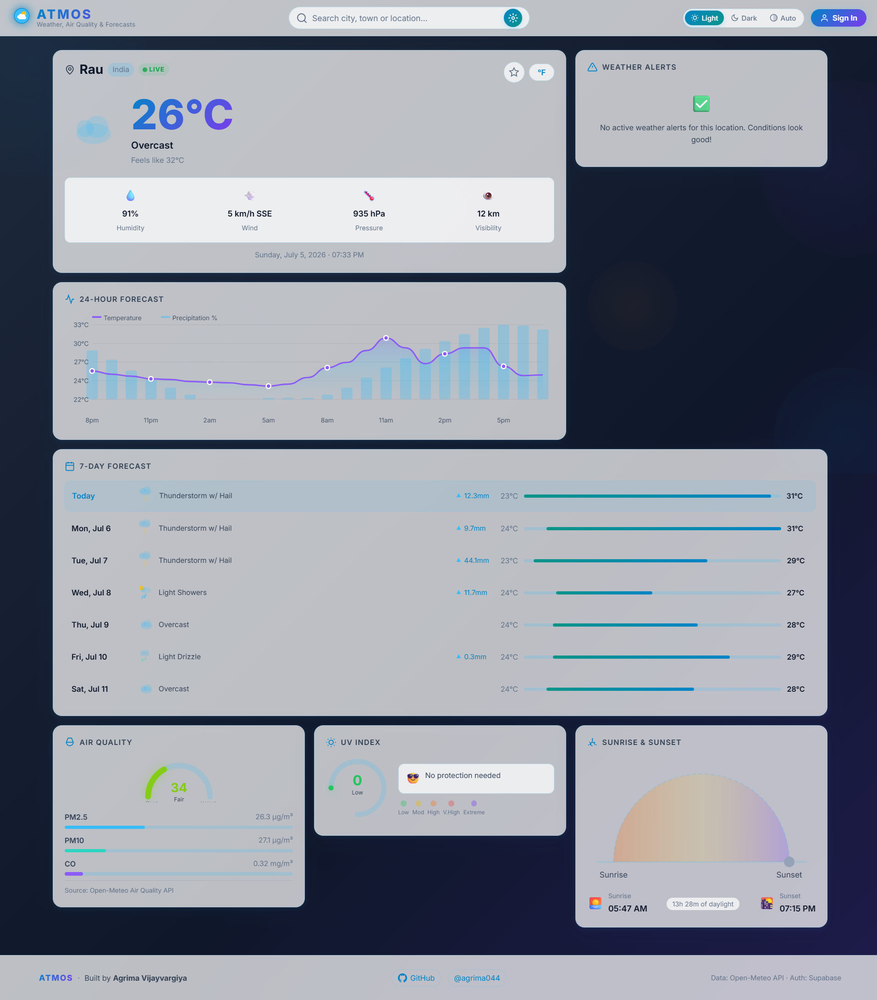
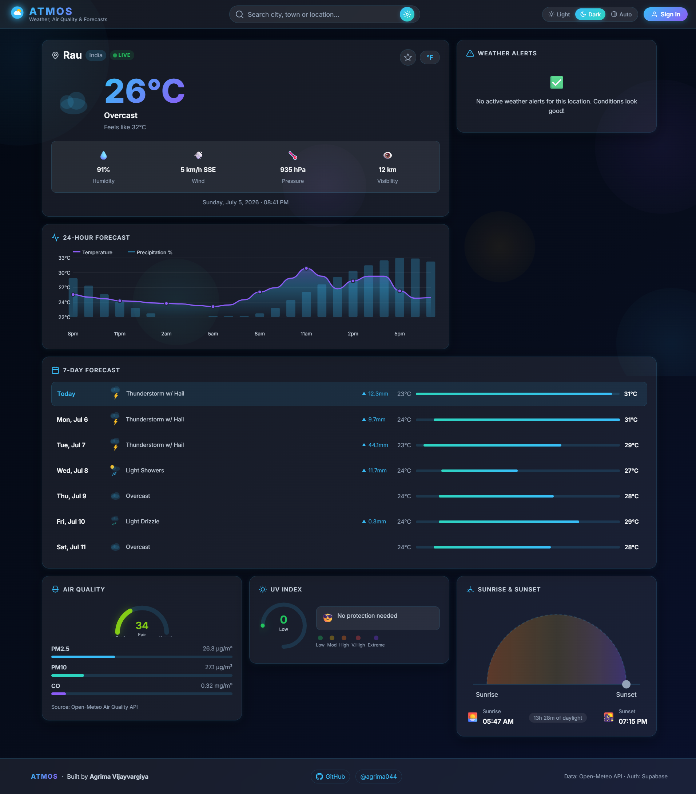
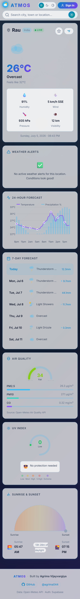
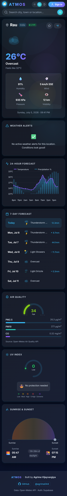

# ATMOS

A modern full-stack weather dashboard built with **Next.js 16**, **React 19**, **TypeScript**, and **Supabase**. ATMOS provides real-time weather insights through a premium StormGlass-inspired interface featuring adaptive gradients, glassmorphism, interactive charts, maps, and personalized user accounts.

---

## 🌐 Live Demo

**🚀 Vercel**

https://atmos-weather-dashboard-alpha.vercel.app/

**📂 GitHub Repository**

https://github.com/agrima044/atmos-weather-dashboard

---

## 📸 Preview

### 💻 Desktop - Light Mode



---

### 🌙 Desktop - Dark Mode



---

### 📱 Mobile

<table>
<tr>
<td align="center">

**☀️ Light Mode**



</td>

<td align="center">

**🌙 Dark Mode**



</td>
</tr>
</table>

# ✨ Features

### 🌦 Weather

- Real-time Weather Conditions
- 5-Day Forecast
- Hourly Forecast
- Feels Like Temperature
- Humidity
- Wind Speed & Direction
- Atmospheric Pressure
- Visibility
- Air Quality Index (AQI)
- UV Index
- Sunrise & Sunset
- Dynamic Weather Recommendations

### 🔍 Search

- City Search
- Geolocation Support
- Recent Searches
- Favorite Cities

### 👤 User Features

- Secure Authentication with Supabase
- Personalized Dashboard
- Favorite Cities Sync Across Devices
- Temperature Unit Preferences

### 📊 Data Visualization

- Interactive Hourly Weather Charts
- AQI Indicator
- UV Progress Ring
- Weather Metric Cards

### 🗺 Maps

- Interactive Weather Map
- Explore Weather by Location

### 🎨 UI / UX

- StormGlass Inspired Design
- Adaptive Weather-Based Backgrounds
- Glassmorphism Interface
- Theme Toggle
- Responsive Layout
- Smooth Animations
- Mobile-First Experience
---

# 🛠 Tech Stack

## Frontend

- Next.js 16
- React 19
- TypeScript
- CSS Modules
- Chart.js
- Leaflet.js

## Backend

- Next.js API Routes
- Supabase Authentication
- Supabase Database

## APIs

- Open-Meteo Weather API
- Open-Meteo Geocoding API
- Open-Meteo Air Quality API

## Deployment

- Vercel
- GitHub

---
# 📁 Project Structure

```text
.
├── app/
│   ├── api/
│   ├── globals.css
│   ├── layout.js
│   └── page.js
├── components/
├── hooks/
├── lib/
├── public/
│   └── icons/
│── preview/
    └── desktop-light-mode.png
    └──desktop-dark-mode.png
    └──mobile-light-mode.png
    └──mobile-dark-mode.png
├── supabase/
│   └── schema.sql
├── .env.example
├── .gitignore
├── eslint.config.mjs
├── jsconfig.json
├── next.config.mjs
├── package.json
├── README.md
└── SETUP.md
```

---

# 🚀 Getting Started

## Clone the repository

```bash
git clone https://github.com/agrima044/atmos-weather-dashboard.git
```

```bash
cd atmos-weather-dashboard
```

## Install dependencies

```bash
npm install
```

## Configure Environment Variables

Create a `.env.local` file.

```env
NEXT_PUBLIC_SUPABASE_URL=your_supabase_url
NEXT_PUBLIC_SUPABASE_ANON_KEY=your_supabase_anon_key
```

## Run the project

```bash
npm run dev
```

Open

```
http://localhost:3000
```

---

# 📈 Roadmap

- Weather Alerts
- Offline Support
- Progressive Web App (PWA)
- Push Notifications
- Multiple Languages
- Theme Customization

---

# 📚 Learning Outcomes

This project helped me gain practical experience with:

- Building scalable applications using Next.js App Router
- Authentication and database integration with Supabase
- Server-side API fetching
- Interactive maps with Leaflet
- Data visualization using Chart.js
- Responsive UI development
- Component-based architecture
- Full-stack deployment with Vercel

---

# 👨‍💻 Author

**agrima044**

---

# 📄 License

This project is licensed under the MIT License.
